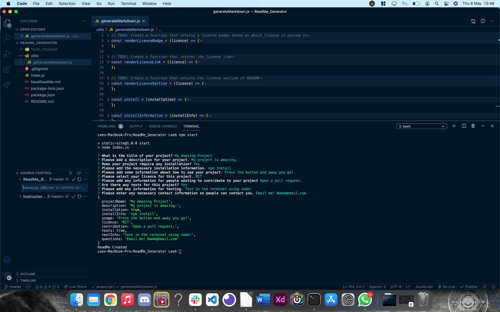
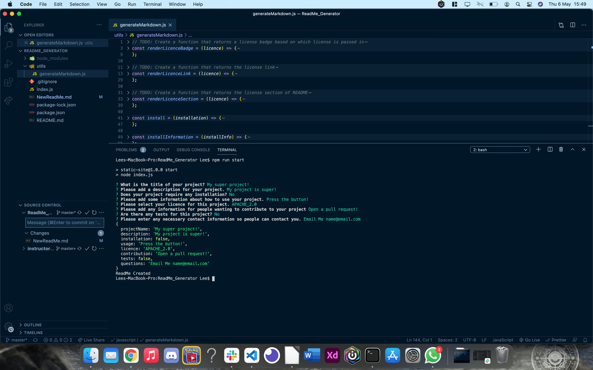

# ReadMe Generator

## Getting Started

This project was to test our skills using node.js. Following the user story, we had to build a Read Me Generator which would create a ReadMe.md file based on the inputs from the user. The user would answer a series of questions, and those answers would show in the ReadMe.

I had to ensure that:

- The questions asked were understandable and fit the ReadMe.
- Ensure that the sections on the ReadMe that was generated were the ones stated in the acceptance criteria.
- Ensure that the licence, when chosen, rendered the badge and a link to that particular licence.
- The table of contents generated would allow to user to click on a title and be taken to that title.

This project was relatively simple, but the challenge I faced was learning how to use inquirer.js to ask the questions and setting up the 'when' functions, when a question was answered in a particular way. I managed to over come this and get the generator to return what I needed it to.

## Link to video

https://drive.google.com/file/d/1--BU4By5dyPqf6pIzuKoSy-PA8EZdDaK/view

## Screenshots

